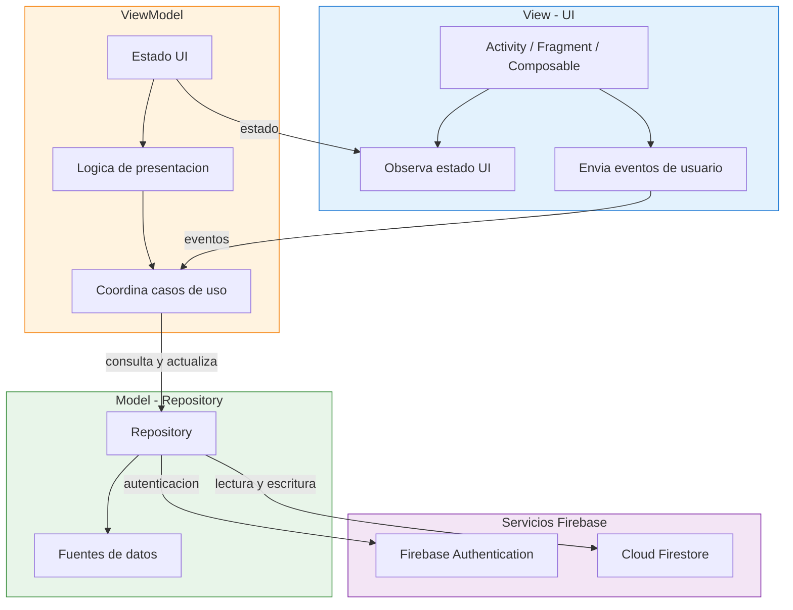

# MediHis

Repositorio para el proyecto MediHis.

## Arquitectura MVVM con Firebase

Este proyecto sigue el patron de diseno **MVVM (Model-View-ViewModel)** integrado con Firebase Authentication y Cloud Firestore.

### Diagrama de Arquitectura

### Componentes

| Capa | Responsabilidad | Tecnologia |
|---|---|---|
| **View** | Mostrar la interfaz y capturar eventos | Activity, Fragment o Compose |
| **ViewModel** | Gestionar el estado y la logica de presentacion | ViewModel, LiveData o StateFlow |
| **Repository** | Abstraer el acceso a los datos | Repository Pattern |
| **Firebase Authentication** | Registrar e identificar usuarios | Firebase Auth |
| **Cloud Firestore** | Almacenar y sincronizar datos | Firebase Firestore |

### Flujo de datos

1. La **View** muestra la interfaz y envia eventos al **ViewModel**.
2. El **ViewModel** procesa los eventos y actualiza el estado de la interfaz.
3. El **ViewModel** solicita datos al **Repository**.
4. El **Repository** utiliza Firebase Authentication para la identidad del usuario.
5. El **Repository** consulta o actualiza la informacion en Cloud Firestore.
6. Los resultados regresan al **ViewModel** y se reflejan en la **View**.

---

*Proyecto desarrollado en el marco de Mobile & Cloud Computing.*
